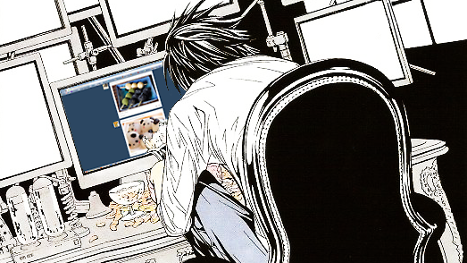

# ezloomdev's Portfolio

## About Me

I am a Computer Science student at Montclair State University, Class of May 2026, specializing in **Cybersecurity**, **Digital Forensics**, and **IT Administration**. My passion lies in securing systems, analyzing digital evidence, and building robust IT infrastructures while developing practical software solutions.

I have hands-on experience in:

- **Cybersecurity & Digital Forensics**: Designing secure systems, performing penetration testing, and investigating digital incidents.  
- **IT Administration**: Managing networks, servers, and VPN environments.  
- **Web & Software Development**: Creating full-stack web applications with HTML, CSS, JavaScript, PHP, and SQL.  

## Projects & Experience

Some highlights of my work include:

- **Self-hosted Security Labs**: Building isolated environments for penetration testing and malware analysis.  
- **Digital Forensics Investigations**: Analyzing evidence, identifying security incidents, and documenting findings.  
- **Automation Tools & Utilities**: Developing scripts and tools to streamline system administration and security workflows.  
- **Portfolio & Web Projects**: Full-stack sites demonstrating secure coding practices and creative problem-solving.  

## Goals

I aim to apply my skills in real-world **cybersecurity**, **digital forensics**, and **IT roles**, while continuously expanding my expertise in:

- Threat detection and mitigation  
- Forensic analysis and evidence handling  
- Secure system and network design  

---

I am motivated by challenges in securing digital environments and uncovering insights from data. I welcome opportunities to collaborate, learn, and contribute to cutting-edge cybersecurity initiatives.
